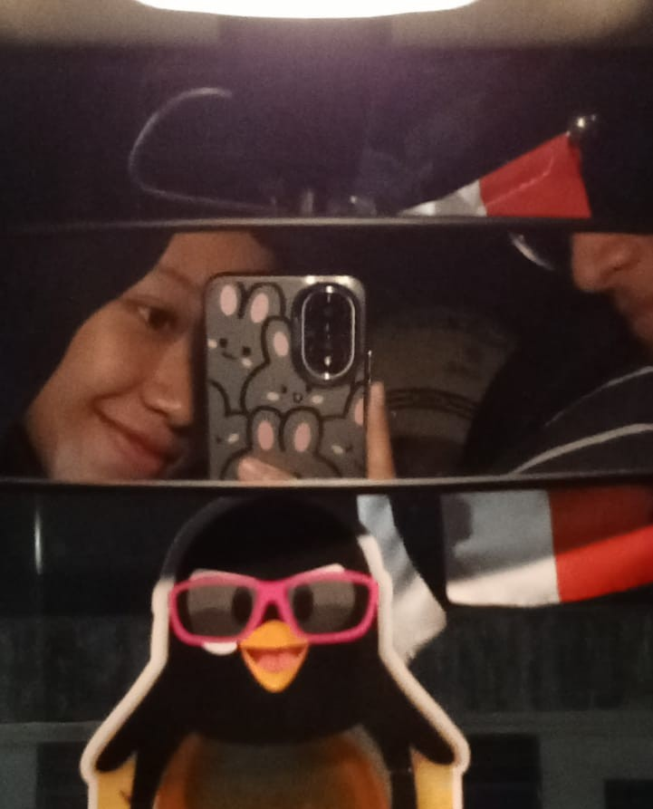
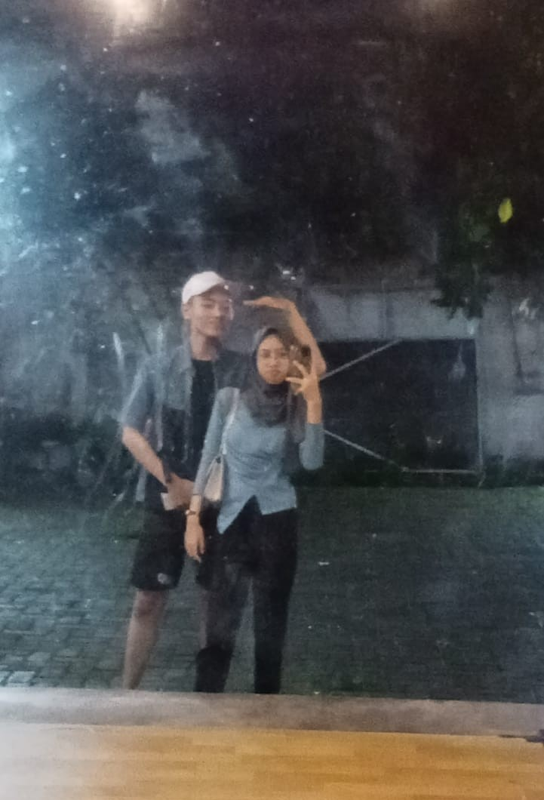

# OUR-MEMORY-RECAP
<!DOCTYPE html>
<html lang="en">
<head>
    <meta charset="UTF-8">
    <meta name="viewport" content="width=device-width, initial-scale=1.0">
    <title></title>
    <link rel="stylesheet" href="memory.css">
    
</head>
<body>
    <ul class="nav flex-column">
        <li class="nav-item">
          <a class="nav-link active" aria-current="page" href="https://drive.google.com/drive/folders/1FEYQQ2ualP_Cs6OMG23USGKC-ZT4DI6A?usp=drive_link">CLICK PLEASE</a>
          <svg xmlns="http://www.w3.org/2000/svg" width="16" height="16" fill="pinkColor" class="bi bi-person-hearts" viewBox="0 0 16 16">
            <path fill-rule="evenodd" d="M11.5 1.246c.832-.855 2.913.642 0 2.566-2.913-1.924-.832-3.421 0-2.566M9 5a3 3 0 1 1-6 0 3 3 0 0 1 6 0m-9 8c0 1 1 1 1 1h10s1 0 1-1-1-4-6-4-6 3-6 4m13.5-8.09c1.387-1.425 4.855 1.07 0 4.277-4.854-3.207-1.387-5.702 0-4.276ZM15 2.165c.555-.57 1.942.428 0 1.711-1.942-1.283-.555-2.281 0-1.71Z"/>
          </svg>
        </li>
        </ul>
    

        

            
            

                

                    <svg xmlns="http://www.w3.org/2000/svg" width="24" height="24" viewBox="0 0 24 24" fill="none" stroke="currentColor" stroke-width="2" stroke-linecap="round" stroke-linejoin="round" class="lucide lucide-heart"><path d="M19 14c1.49-1.46 3-3.21 3-5.5A5.5 5.5 0 0 0 16.5 3c-1.76 0-3 .5-4.5 2-1.5-1.5-2.74-2-4.5-2A5.5 5.5 0 0 0 2 8.5c0 2.3 1.5 4.05 3 5.5l7 7Z">
                        <line x1="6" x2="10" y1="11" y2="11"></line>
                        <line x1="8" x2="8" y1="9" y2="13" />
                        <line x1="15" x2="15.01" y1="12" y2="12" />
                        <line x1="18" x2="18.01" y1="10" y2="10" />
                        <path d="M17.32 5H6.68a4 4 0 0 0-3.978 3.59c-.006.052-.01.101-.017.152C2.604 9.416 2 14.456 2 16a3 3 0 0 0 3 3c1 0 1.5-.5 2-1l1.414-1.414A2 2 0 0 1 9.828 16h4.344a2 2 0 0 1 1.414.586L17 18c.5.5 1 1 2 1a3 3 0 0 0 3-3c0-1.545-.604-6.584-.685-7.258-.007-.05-.011-.1-.017-.151A4 4 0 0 0 17.32 5z" />
                    </svg>
                

                <h3 class="title">OUR SECOND THEATER DATE</h3>
        

        

      

      

        
        

            

                <svg xmlns="http://www.w3.org/2000/svg" width="24" height="24" viewBox="0 0 24 24" fill="none" stroke="currentColor" stroke-width="2" stroke-linecap="round" stroke-linejoin="round" class="lucide lucide-heart"><path d="M19 14c1.49-1.46 3-3.21 3-5.5A5.5 5.5 0 0 0 16.5 3c-1.76 0-3 .5-4.5 2-1.5-1.5-2.74-2-4.5-2A5.5 5.5 0 0 0 2 8.5c0 2.3 1.5 4.05 3 5.5l7 7Z"/></svg>
                <line x1="6" x2="10" y1="11" y2="11" />
                <line x1="8" x2="8" y1="9" y2="13" />
                <line x1="15" x2="15.01" y1="12" y2="12" />
                <line x1="18" x2="18.01" y1="10" y2="10" />
                <path d="M17.32 5H6.68a4 4 0 0 0-3.978 3.59c-.006.052-.01.101-.017.152C2.604 9.416 2 14.456 2 16a3 3 0 0 0 3 3c1 0 1.5-.5 2-1l1.414-1.414A2 2 0 0 1 9.828 16h4.344a2 2 0 0 1 1.414.586L17 18c.5.5 1 1 2 1a3 3 0 0 0 3-3c0-1.545-.604-6.584-.685-7.258-.007-.05-.011-.1-.017-.151A4 4 0 0 0 17.32 5z" />
              </svg>
            

            <h3 class="title">OUR FIRST COUPLE OUTFIT</h3>
          

          

        

        

            
            

              

                <svg xmlns="http://www.w3.org/2000/svg" width="24" height="24" viewBox="0 0 24 24" fill="none" stroke="currentColor" stroke-width="2" stroke-linecap="round" stroke-linejoin="round" class="lucide lucide-heart"><path d="M19 14c1.49-1.46 3-3.21 3-5.5A5.5 5.5 0 0 0 16.5 3c-1.76 0-3 .5-4.5 2-1.5-1.5-2.74-2-4.5-2A5.5 5.5 0 0 0 2 8.5c0 2.3 1.5 4.05 3 5.5l7 7Z"/></svg>
                  <line x1="6" x2="10" y1="11" y2="11" />
                  <line x1="8" x2="8" y1="9" y2="13" />
                  <line x1="15" x2="15.01" y1="12" y2="12" />
                  <line x1="18" x2="18.01" y1="10" y2="10" />
                  <path d="M17.32 5H6.68a4 4 0 0 0-3.978 3.59c-.006.052-.01.101-.017.152C2.604 9.416 2 14.456 2 16a3 3 0 0 0 3 3c1 0 1.5-.5 2-1l1.414-1.414A2 2 0 0 1 9.828 16h4.344a2 2 0 0 1 1.414.586L17 18c.5.5 1 1 2 1a3 3 0 0 0 3-3c0-1.545-.604-6.584-.685-7.258-.007-.05-.011-.1-.017-.151A4 4 0 0 0 17.32 5z" />
                </svg>
              

              <h3 class="title">OUR SECOND COUPLE OUTFIT</h3>
            

            

          

          

            
            

              

                <svg xmlns="http://www.w3.org/2000/svg" width="24" height="24" viewBox="0 0 24 24" fill="none" stroke="currentColor" stroke-width="2" stroke-linecap="round" stroke-linejoin="round" class="lucide lucide-heart"><path d="M19 14c1.49-1.46 3-3.21 3-5.5A5.5 5.5 0 0 0 16.5 3c-1.76 0-3 .5-4.5 2-1.5-1.5-2.74-2-4.5-2A5.5 5.5 0 0 0 2 8.5c0 2.3 1.5 4.05 3 5.5l7 7Z"/></svg>
                  <line x1="6" x2="10" y1="11" y2="11" />
                  <line x1="8" x2="8" y1="9" y2="13" />
                  <line x1="15" x2="15.01" y1="12" y2="12" />
                  <line x1="18" x2="18.01" y1="10" y2="10" />
                  <path d="M17.32 5H6.68a4 4 0 0 0-3.978 3.59c-.006.052-.01.101-.017.152C2.604 9.416 2 14.456 2 16a3 3 0 0 0 3 3c1 0 1.5-.5 2-1l1.414-1.414A2 2 0 0 1 9.828 16h4.344a2 2 0 0 1 1.414.586L17 18c.5.5 1 1 2 1a3 3 0 0 0 3-3c0-1.545-.604-6.584-.685-7.258-.007-.05-.011-.1-.017-.151A4 4 0 0 0 17.32 5z" />
                </svg>
              

              <h3 class="title">OUR FIRST DATE AGAIN</h3>
            

            

          

          

            
            

              

                <svg xmlns="http://www.w3.org/2000/svg" width="24" height="24" viewBox="0 0 24 24" fill="none" stroke="currentColor" stroke-width="2" stroke-linecap="round" stroke-linejoin="round" class="lucide lucide-heart"><path d="M19 14c1.49-1.46 3-3.21 3-5.5A5.5 5.5 0 0 0 16.5 3c-1.76 0-3 .5-4.5 2-1.5-1.5-2.74-2-4.5-2A5.5 5.5 0 0 0 2 8.5c0 2.3 1.5 4.05 3 5.5l7 7Z"/></svg>
                  <line x1="6" x2="10" y1="11" y2="11" />
                  <line x1="8" x2="8" y1="9" y2="13" />
                  <line x1="15" x2="15.01" y1="12" y2="12" />
                  <line x1="18" x2="18.01" y1="10" y2="10" />
                  <path d="M17.32 5H6.68a4 4 0 0 0-3.978 3.59c-.006.052-.01.101-.017.152C2.604 9.416 2 14.456 2 16a3 3 0 0 0 3 3c1 0 1.5-.5 2-1l1.414-1.414A2 2 0 0 1 9.828 16h4.344a2 2 0 0 1 1.414.586L17 18c.5.5 1 1 2 1a3 3 0 0 0 3-3c0-1.545-.604-6.584-.685-7.258-.007-.05-.011-.1-.017-.151A4 4 0 0 0 17.32 5z" />
                </svg>
              

              <h3 class="title">LATEST US</h3>
            

            

        

    

</body>
</html>
